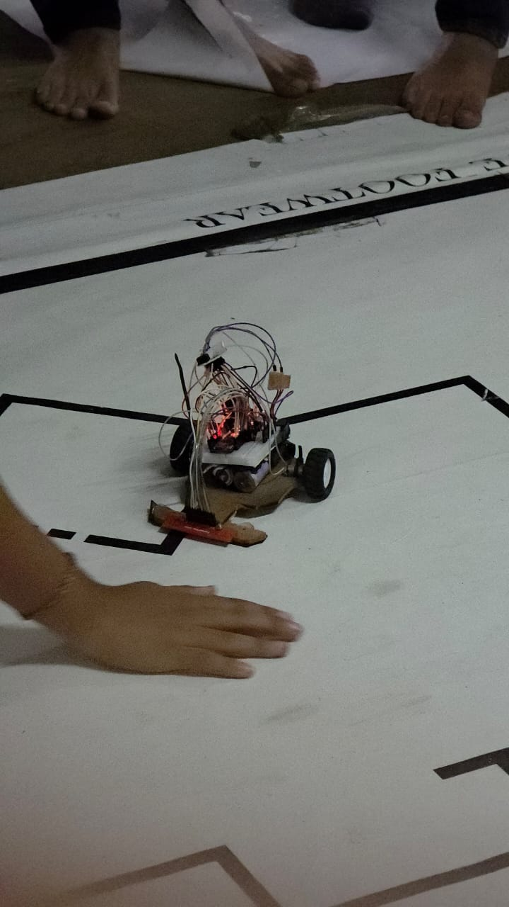
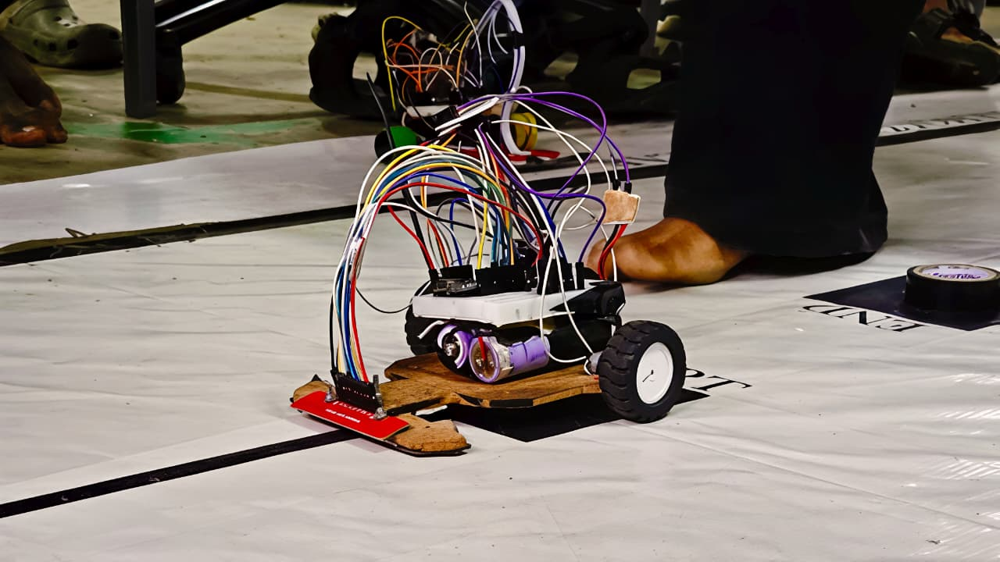

# Arduino Line Follower Robot

A threshold-based autonomous line-following robot built around an Arduino Nano, QTR-8RC sensor array, TB6612FNG motor driver, and DC geared motors.

The project focuses on the hardware-software control loop: reading multiple sensor inputs, deciding the robot's direction from sensor states, and controlling the motors using PWM.



## Features

- 8-channel QTR-8RC line sensing
- Arduino Nano-based control
- TB6612FNG dual motor driver
- PWM-based motor speed control
- Threshold-based steering decisions
- Separate left, right, and forward movement routines
- Status LED for sensor-state indication

## Hardware

| Component | Details |
|---|---|
| Microcontroller | Arduino Nano |
| Line sensor | QTR-8RC, 8-channel |
| Motor driver | TB6612FNG |
| Motors | DC geared motors |
| Power | 2S 7.4 V LiPo |
| Motor control | PWM |
| Sensor inputs | A0-A7 |

### Robot Close-up



## How It Works

The sensor array provides eight sensor readings. The program compares each reading against a fixed threshold and uses groups of sensors to determine the required steering direction.

The current implementation uses **rule-based threshold control** rather than PID control.

## Pin Configuration

| Arduino Nano | Function |
|---|---|
| D4 | Motor A IN2 |
| D5 | Motor A PWM |
| D6 | Motor B PWM |
| D7 | Motor A IN1 |
| D8 | Motor B IN1 |
| D9 | Motor B IN2 |
| D12 | TB6612FNG STBY |
| D2 | Status LED |
| A0-A7 | QTR-8RC sensor inputs S1-S8 |

## Software

- Arduino IDE
- Arduino C/C++
- `analogRead()` for sensor readings
- `analogWrite()` for motor PWM
- Digital GPIO for motor direction control

## Running the Project

1. Open `arduino-line-follower-robot.ino` in Arduino IDE.
2. Select the Arduino Nano and the appropriate processor/port.
3. Connect the QTR-8RC sensor array according to the pin configuration above.
4. Connect the TB6612FNG motor driver and motors.
5. Power the robot using the intended battery and regulator setup.
6. Upload the sketch.
7. Test the robot on the line-following track and tune the threshold/speed values for the physical setup.

> **Note:** The repository intentionally keeps the original control code unchanged. The documentation describes the implementation as it currently exists.

## Current Limitations

- Fixed sensor threshold
- Rule-based steering rather than PID control
- Motor speeds are manually tuned
- No encoder-based closed-loop speed control
- No runtime sensor calibration routine

## Future Improvements

- PID-based steering control
- Sensor calibration at startup
- Encoder feedback
- More robust line-loss recovery
- Configurable motor-speed parameters
- Improved handling of sharp turns and intersections

## Project Structure

```text
arduino-line-follower-robot/
├── README.md
├── arduino-line-follower-robot.ino
├── media/
│   ├── robot-overview.jpeg
│   └── robot-closeup.jpeg
└── docs/
    ├── control-logic.md
    └── hardware.md
```

## Author

**Siddhant Hirave**

Computer Engineering student interested in robotics, embedded systems, automation, and practical hardware-software projects.
